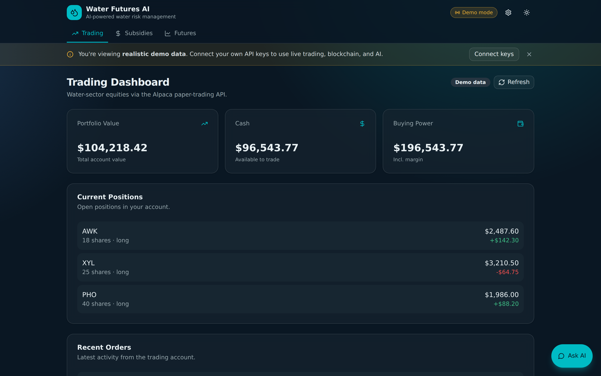
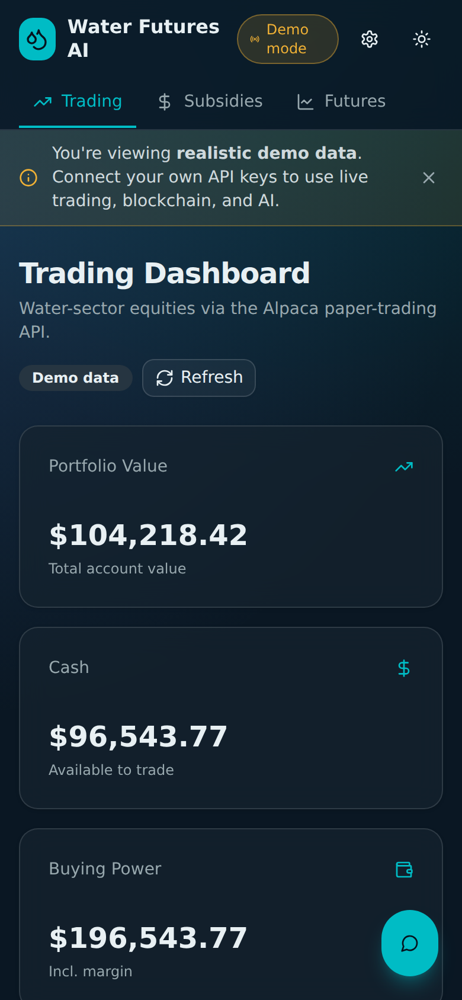
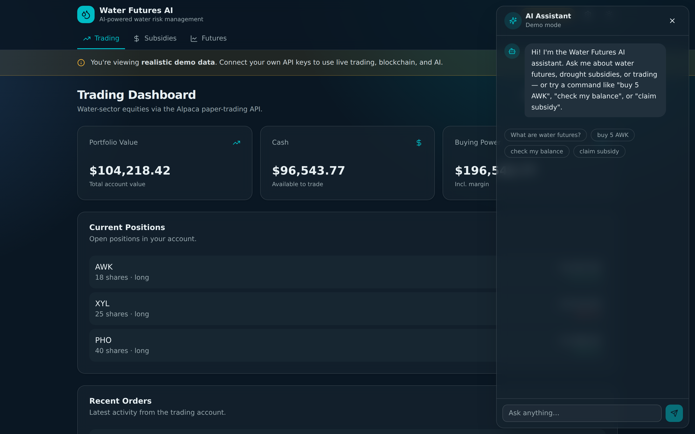

<div align="center">

# 💧 Water Futures AI

### AI-powered water-scarcity risk management — trading, drought analytics, and blockchain subsidies in one platform.

[](https://nextjs.org)
[](https://react.dev)
[](https://www.typescriptlang.org)
[](https://tailwindcss.com)
[](https://www.anthropic.com)
[](./LICENSE)

**[▶ Live Demo](https://water-futures-ai.vercel.app)**  ·  [Features](#-features)  ·  [Architecture](#-architecture)  ·  [Run locally](#-run-locally)

</div>

<p align="center">
  
</p>

---

## Overview

Water is becoming a traded commodity. Water Futures AI is a single, polished interface where an
agricultural stakeholder can **monitor water-sector markets, claim drought-triggered subsidies, review
ML-driven futures signals, and do it all through natural language** with an AI assistant.

It integrates four domains that rarely meet in one place — **markets, climate data, blockchain payments,
and LLMs** — and ships with a design decision that makes it genuinely usable by anyone:

> **It works with zero configuration.** Open the live demo and every feature is explorable with realistic
> sample data, clearly labeled. Want real data? Add your own API keys in-app (stored only in your browser)
> and any feature flips to live. No hidden fallbacks, no broken empty states.

This started as a hackathon project and was refactored into a portfolio-grade application: responsive on
mobile and desktop, type-safe, and honest about what's demo vs. live.

## ✨ Features

| | |
|---|---|
| 🤖 **AI assistant** | Natural-language help and commands (`buy 5 AWK`, `check my balance`, `claim subsidy`), powered by Claude when a key is connected. |
| 📈 **Trading dashboard** | Account value, positions, and order history via the Alpaca paper-trading API. |
| 💸 **Drought subsidies** | USDC transfers on Ethereum Sepolia via Crossmint, with subsidy rates that scale to drought severity. |
| 🛰️ **Futures analysis** | Trading signals derived from a drought-prediction ML pipeline (NQH2O index + GRIDMET indicators). |
| 🎚️ **Demo / Live modes** | Transparent demo data by default; bring-your-own-key to go live, with a clear status indicator. |
| 📱 **Responsive + themed** | Works on phone and desktop, with light and dark themes. |

<p align="center">
  
  
</p>

## 🧭 Demo Mode & Bring-Your-Own-Key

The defining design decision of this project. Credentials are resolved on the server with a clear precedence:

```
per-request header (your key, in-browser)  →  server env var  →  built-in demo data
```

- **No keys** → realistic demo data, every screen fully populated and labeled **“Demo data.”**
- **Your keys** (entered in the in-app Settings panel) → that feature switches to **live**. Keys live only in
  your browser's `localStorage`, are sent per-request, and are **never persisted server-side or logged.**
- **Server env vars** → for a private deployment where the owner supplies the keys.

This means the public demo always looks complete to a visitor, while remaining honest and secure.

## 🏗️ Architecture

```
┌──────────────────────────────────────────────────────────────┐
│                Next.js App Router (React 19, TS)               │
│   Header · Tabs · Theme · Settings (BYOK) · Floating AI chat   │
└───────────────┬───────────────────────────────┬───────────────┘
                │ fetch() with credential headers │
                ▼                                 ▼
┌──────────────────────────────┐   ┌──────────────────────────────┐
│  Route handlers (app/api/*)  │   │   Credential resolution        │
│  per-request → env → demo    │──▶│  header → env → demo (flag)    │
└───────┬─────────┬─────────┬──┘   └──────────────────────────────┘
        ▼         ▼         ▼
   ┌────────┐ ┌─────────┐ ┌────────┐
   │ Alpaca │ │Crossmint│ │ Claude │   (live only when a key is present)
   │ paper  │ │ Sepolia │ │  API   │
   └────────┘ └─────────┘ └────────┘
```

**Tech stack:** Next.js 15 · React 19 · TypeScript · Tailwind CSS v4 · shadcn/ui · Radix UI ·
`@anthropic-ai/sdk` · Alpaca & Crossmint REST APIs.

## 🛰️ The data-science pipeline

The futures-analysis view is grounded in a real research notebook
([`research/notebooks/NQH2O_Prediction_GridMET.ipynb`](research/notebooks/NQH2O_Prediction_GridMET.ipynb)):

- **497 weekly NQH2O** water-index observations (2018–2025)
- **85+ GRIDMET drought indicators** (SPI, SPEI, PDSI, EDDI) across five California water basins
- Feature engineering into 300+ lagged/composite features, with an ensemble of regression models

Reference Python MCP servers for the Alpaca and Crossmint integrations live in
[`research/mcp-servers/`](research/mcp-servers/).

## 🚀 Run locally

**Prerequisites:** Node.js 18+.

```bash
git clone https://github.com/ravejedii/water-warriors.git
cd water-warriors
npm install
npm run dev          # http://localhost:3000
```

That's it — the app runs in demo mode out of the box. To enable live data, either click **Settings** in the
app and paste your own keys, or copy `.env.example` to `.env.local` and fill in the values you have:

```bash
cp .env.example .env.local
```

All keys are optional and independent; provide only the ones you want to go live.

## ▲ Deploy

This is a standard Next.js app and deploys to [Vercel](https://vercel.com) with no extra configuration:

[](https://vercel.com/new/clone?repository-url=https://github.com/ravejedii/water-warriors)

The deployment runs in demo mode unless you add the optional environment variables from `.env.example` in
the Vercel project settings.

## 📁 Project structure

```
app/            App Router pages, layout, and API route handlers
components/     UI components (dashboards, chatbot, settings) + shadcn/ui primitives
lib/            Demo data, client BYOK context, server credential resolution
research/       ML notebook + reference MCP servers
docs/           Screenshots
```

See [CLAUDE.md](./CLAUDE.md) for an architecture deep-dive.

## 📜 License

[MIT](./LICENSE) © [ravejedii](https://github.com/ravejedii)

<div align="center"><sub>Turning drought data into actionable insight.</sub></div>
